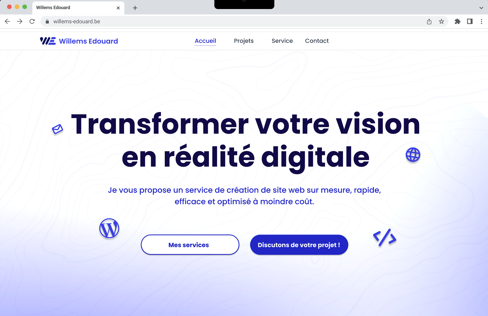
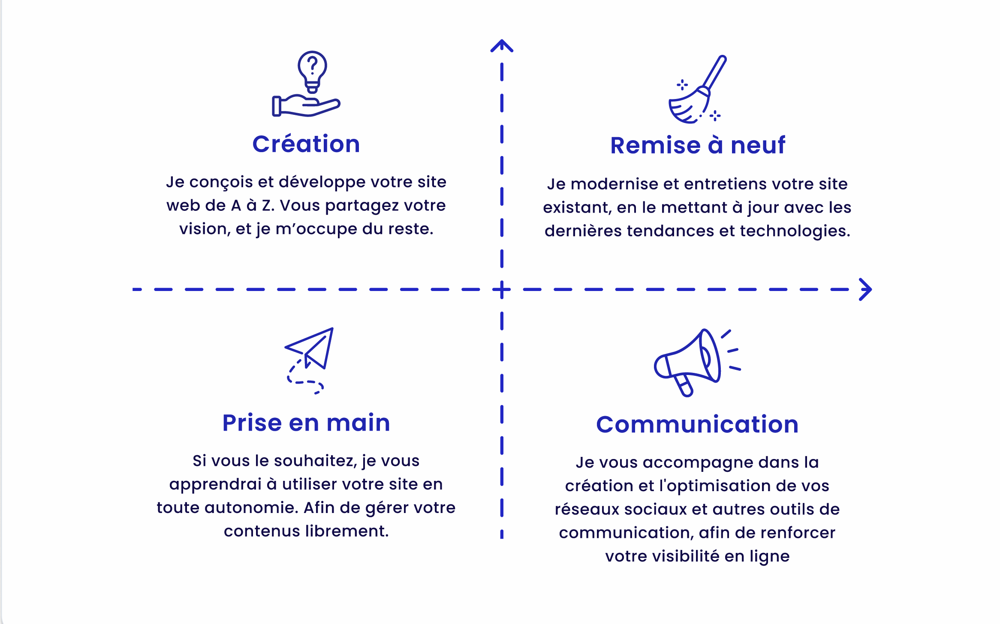
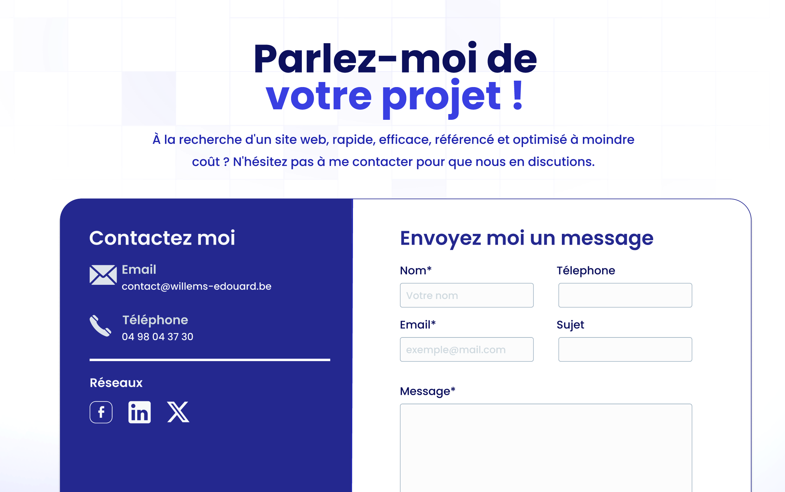
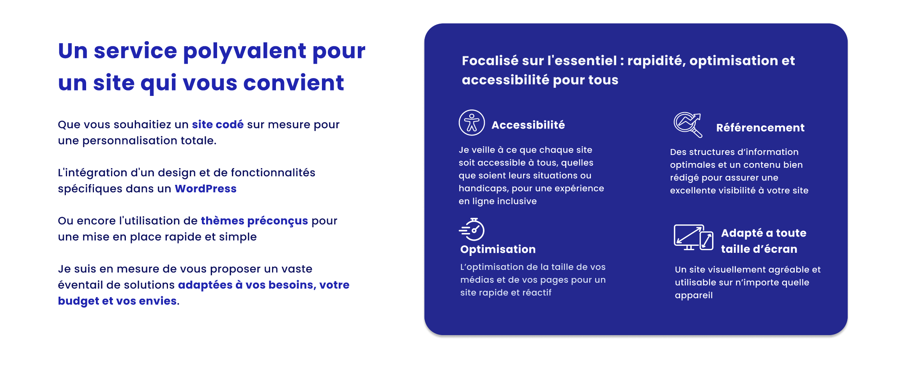

# Old Portfolio / Landing Page (Laravel)

> 🗃️ This is a former personal portfolio built with Laravel. The project is no longer maintained, but I'm sharing it here as a reference and part of my past work.

This project was designed as a simple landing page to showcase my profile, services, and projects, with a functional contact form.

## ⚙️ Tech Stack

-   **Backend**: Laravel
-   **Frontend**: Blade templates + CSS & Tailwind
-   **Key Features**:
    -   Homepage
    -   Services page describing what I was offering
    -   Projects list page
    -   Contact form with validation and email sending

## 📸 Preview

  
  

  
  

## 🗒️ Notes

-   This project is no longer live or actively used, so some dependencies might be outdated.
